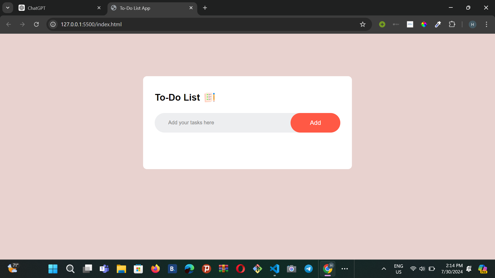
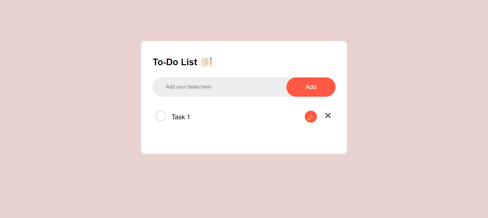
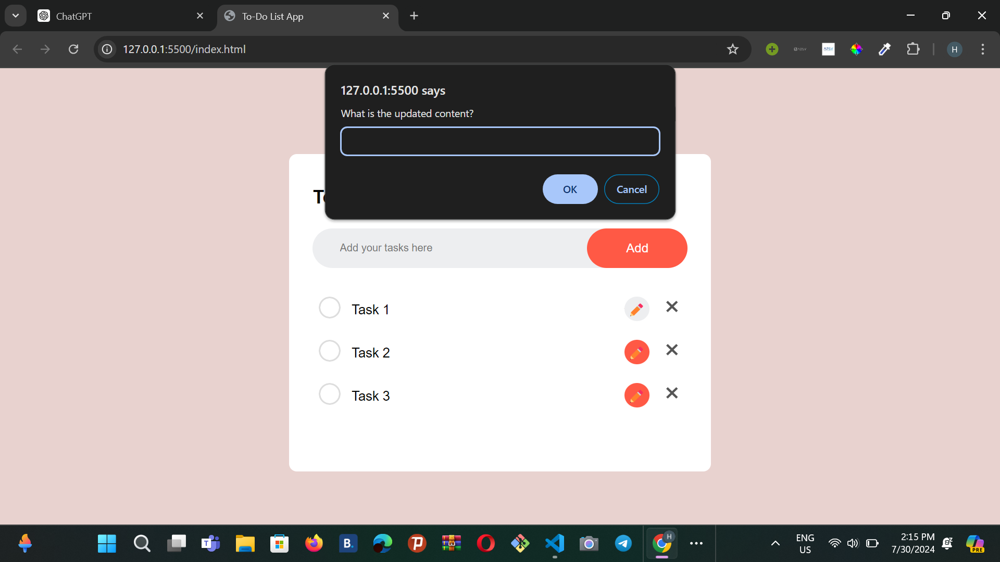
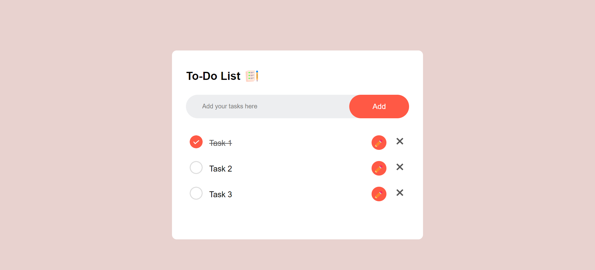
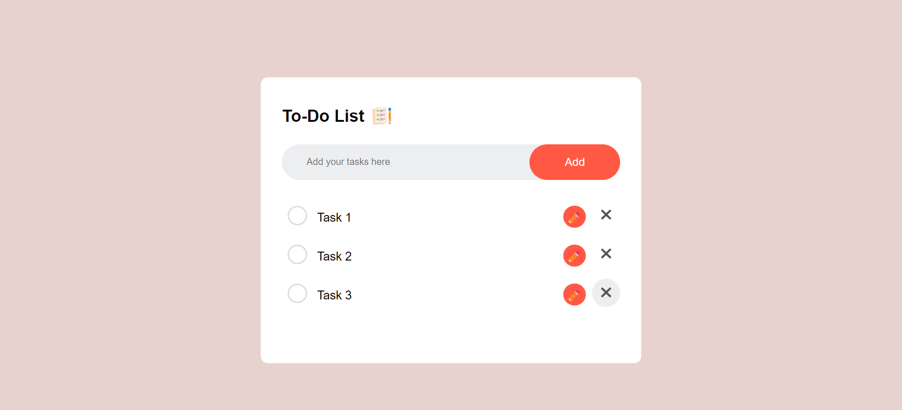

# To-Do List App

This is a simple to-do list application that allows you to add, check, edit, and remove tasks.
## Screenshots

### Main Interface


*Screenshot of the main interface*

### Adding a Task


*Screenshot showing how to add a new task to the list.*

### Editing Task Step 1

*This screenshot shows the initial state of the task list before editing. When the edit button is clicked*

### Editing Task Step 2
.png)
*This screenshot illustrates writing the updated version.*

### Editing Task Step 3
.png)
*This screenshot demonstrates the task text being modified and saved.*

*Screenshot demonstrating the task editing functionality.*

### Checking a Task


*Screenshot illustrating how to mark a task as completed.*

### Removing a Task Step 1


*Screenshot depicting the selection of the task to be deleted*

### Removing a Task Step 2
.png)

*Screenshot depicting the removal of a task from the list.*

## Features

- **Add Task**: Add a new task to the list.
- **Check/Uncheck Task**: Mark a task as completed or incomplete.
- **Edit Task**: Modify the text of an existing task.
- **Remove Task**: Delete a task from the list.

## Getting Started

These instructions will help you set up and run the to-do list app on your local machine.

### Prerequisites

You need a web browser to run this application. No other software or dependencies are required.

### Running the App

1. **Clone the repository**:
    ```sh
    git clone https://github.com/hawetengg/To-do-App.git
    ```
2. **Navigate to the project directory**:
    ```sh
    cd To-do-App
    ```
3. **Open the `index.html` file in your web browser**:
    - You can do this by double-clicking the `index.html` file, or by right-clicking it and selecting "Open with" and then your preferred web browser.

### Usage

1. **Add a Task**:
    - Enter a task description in the input field at the top of the page.
    - Press the "Add" button.

2. **Check/Uncheck a Task**:
    - Click the checkbox before a task to mark it as completed or incomplete.

3. **Edit a Task**:
    - Click the edit button edit.
    - Modify the text as needed and press "Ok" to save the changes.

4. **Remove a Task**:
    - Click the "Remove" button next to the task you want to delete.

